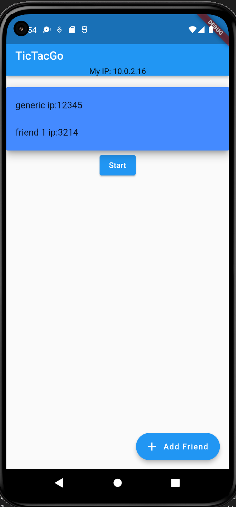

# tictacgo
CSCI 352: Mobile Software Development 
Project 4: Networking
Collaborators: Ryan Fuller, Jonathon Qualls, Taylor Aishman

Audience:
The audience for this app is anyone want to play tic tac to with their friends from their phone and play and replay it infinetly. 

App functionality:
The app is a simple tic tac to game to entertain you and your friends.

Usefulness:
Sometimes you just need something to occupy your time and quick and easy to use phone games are a perfect solution to that. 

Screenshots:

